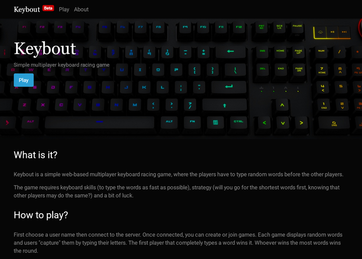
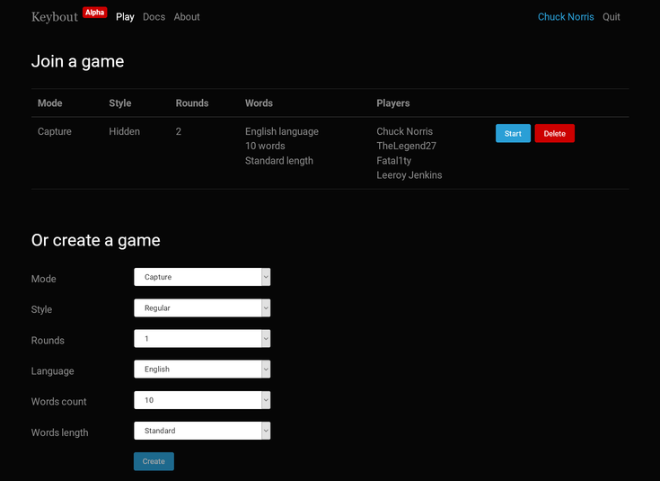
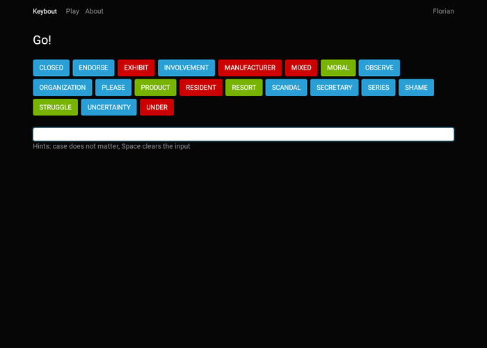
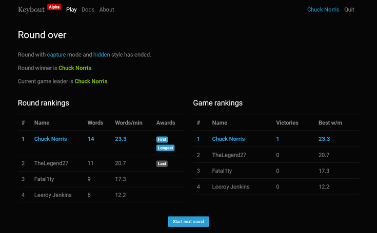

# Keybout

Keybout is a simple web-based multiplayer keyboard racing game, where the players
have to type random words before the other players.

The first version started in 2014 as a sample WebSocket application and used JavaScript,
WebSocket, Java EE 7 and Java.

This second version, started in 2019, is a full rewrite based on Angular, SockJS, Spring Boot and Kotlin.

The application home page briefly describes the application:

The games page is used to create a new game or join an existing one.

When creating a new game you can choose several attributes such as:
- The mode: **capture** (the first player to type a word wins it) or **race** (each player has to type all words)
- The style: **regular** (words are displayed as is), **hidden** (some word letters are hidden), **anagram** (the word letters are mixed),
  **calculus** (simple math operations are displayed instead of words)
- The language of the words: english or french

The game page is where the action happens:
- **Blue** words are available, quickly type them (some letters are missing since this game uses the hidden style)
- **Green** words were won by the current player
- **Red** words were won by other players

When a round is over, the scores page displays the results for the current round as well as for all rounds of the current game.

If also displays the players type speed (in words per minutes) as well as several awards (for example who typed the first word).

## Usage

Prerequisites: Java 17, Node.js 16+ with NPM

To start the frontend locally, run `npm install` then `ng serve` in `keybout-frontend`
folder or use your IDE.

To start the backend locally, run `mvnw spring-boot:run` in `keybout-backend`
folder or use your IDE.

To build a single deployable fat jar containing the whole application,
run `mvnw package -Pfull` from the home folder then use `keybout-backend/target/keybout-backend.jar`.
Omit `-Pfull` if you prefer to separate the frontend and backend packages.

The application uses an optional MongoDB database to persist some data,
if the `spring.data.mongodb.uri` is defined.

To run in production, deploy the fat jar and run with several environment variables:
- APPLICATION_DATATYPE: "prod"
- LOG_DATEFORMAT_PATTERN: optional, use an empty string (i.e. two consecutive double quotes) to disable
  the timestamp in the Spring logs when the cloud platform (such as Heroku) adds its own timestamp
- SPRING_DATA_MONGODB_URI: optional, the MongoDB URI
